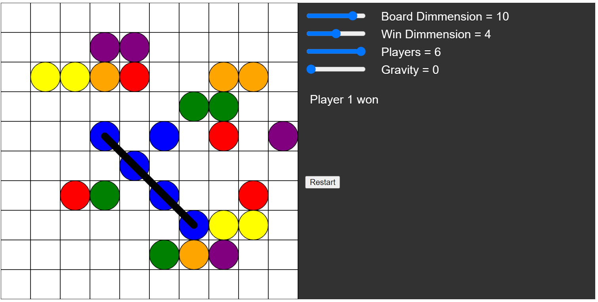

# TicTacTooExtraP5

Adjustable TicTacToo

- Customize your board with 5 to 11 squares in both horizontal and vertical directions.
- Set your win condition by selecting 3 to 5 squares in a row.
- Play with 2 to 6 players.

Note: The game will reset when sliders are adjusted.

